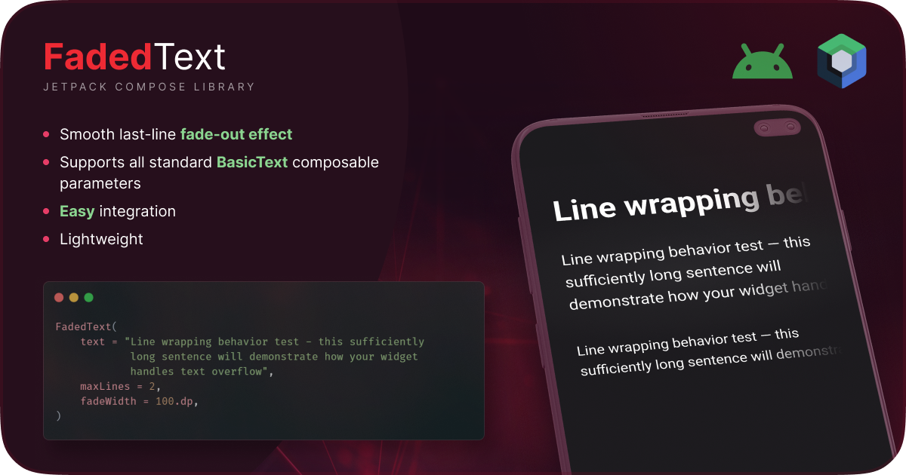

# Faded Text for Jetpack Compose

[](https://opensource.org/licenses/Apache-2.0)   [](https://kotlinlang.org) [](https://developer.android.com/jetpack/androidx/releases/compose-foundation)


A lightweight Android library built on top of `BasicText` that provides text with configurable smooth fading effect on the last line, compatible with Compose foundation. You can control **width** of the fade area (through the `fadeWidth` parameter).



## Features ✨
- Smooth last-line fade-out effect
- Supports all standard `BasicText` composable parameters
- Easy integration

| Parameter              | Type         | Default      | Description                |
|------------------------|--------------|--------------|----------------------------|
| `text`                 | `String`     | **Required** | Text content               |
| `fadeWidth`            | `Dp`         | `40.dp`      | Horizontal fade area width |
| *All BasicText params* | -            | -            | Fully supported            |

## Installation 📦

### Step 1
Add repository to your `gradle.build` file **(project)**
```gradle
allprojects {
  repositories {
    maven { url 'https://jitpack.io' }
  }
}


```
### Step 2
[](https://jitpack.io/#er-nick-cr/FadedText)

Add dependency to your `gradle.build` file __(app) or other module__
```gradle
dependencies {
   implementation("com.github.ernickcr:faded-text:LATEST_VERSION")
}
```


## Usage
```kotlin
FadedText(
    text = "Line wrapping behavior test - this sufficiently long sentence will demonstrate how your widget handles text overflow...",
    maxLines = 2,
    fadeWidth = 100.dp,
)
```

## License:
```
Apache 2.0 LICENSE

Copyright (c) 2025 Eremeev Nikita.

Licensed under the Apache License, Version 2.0 (the "License");
you may not use this file except in compliance with the License.
You may obtain a copy of the License at

   http://www.apache.org/licenses/LICENSE-2.0

Unless required by applicable law or agreed to in writing, software
distributed under the License is distributed on an "AS IS" BASIS,
WITHOUT WARRANTIES OR CONDITIONS OF ANY KIND, either express or implied.
See the License for the specific language governing permissions and
limitations under the License.
```
